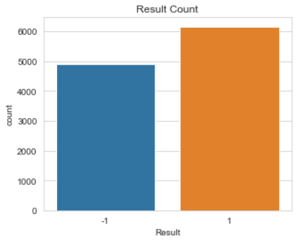
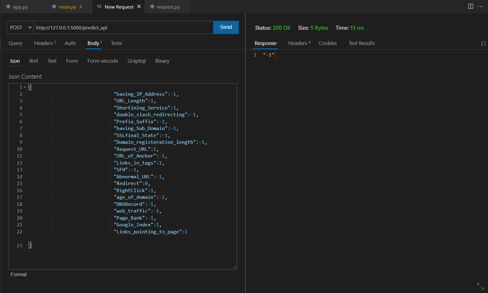

# PhishingClassifier
### Buisness Problem:
     Phishing is the fraudulent attempt to obtain sensitive data, such as usernames, passwords by disguising a fake website
     as a trustworthy website.Therefore identifying Phishing websites maximizes internet security.
### Target Variable: Result
    If Result = 1, Not a Phishing website
    If Result = -1, Phishing website.
    
Data is having 30 predictor attributes and one response variable with binary classes. 0 out of 2456 records is missing for all columns.1362 records are of trust-worthy websites(majority class) and  1094 records are Phishing websites(Minority class)

The datatype of predictors are taken as int64, Howerver the predictors are nominal. Therefore Quantitative analysis like correlation has no or less signficance.

### Exploratory Data analysis
Since predictors are categorical, they are plotted as Bivariate countplots  where class labels are represented as color of the bars.

Looking at the plots we can see that Features like SSL_Final_state, web_traffic,Domain_registeration_length, URL_of_anchor have a greater difference between the classes. 
And Almost all features are having atleast some difference between two classes. So these variances must be captured.

Chi_Squared test is used to find the relationship between categorical features by measuring their independence.
We hypothesize H0:Feature is independent of Result as our null statement
We choose our p-value level to 0.05, If the p-value test result is more than 0.05 we fail to reject the Null Hypothesis. This means, there is no relationship between the feature  and Result feature based on the Chi-Square test of independence.
For the features 'Statistical_report','Iframe','popUpWidnow','on_mouseover','Submitting_to_email','HTTPS_token','port','Favicon','having_At_Symbol' we fail to reject the Null hypothesis. So they are droped

finally Random forest and XGBoost algorithm works fine and used for further prediction 

### Accuracies

Random forest shows accuracy of 96% 

XGBoost algorithm shows accuracy of 96.38%
 
###  Flask API testing

when user hits the  http://127.0.0.1:5000/predict_api with  input data (json format) in any API testing platforms
like Postman , Thunderclient(inbuilt in vscode) it will jsonify the output and prints in console

example input data:
''''

{

                             "having_IP_Address":-1, 

                             "URL_Length":1,

                             "Shortining_Service":1,

                             "double_slash_redirecting":-1,

                             "Prefix_Suffix":-1,

                             "having_Sub_Domain":-1,

                             "SSLfinal_State":-1,

                             "Domain_registeration_length":-1,

                             "Request_URL":1,

                             "URL_of_Anchor":-1,

                             "Links_in_tags":1,

                             "SFH":-1,

                             "Abnormal_URL":-1,

                             "Redirect":0,

                             "RightClick":1,

                             "age_of_domain":-1,

                             "DNSRecord":-1,

                             "web_traffic":-1,

                             "Page_Rank":-1,

                             "Google_Index":1,

                             "Links_pointing_to_page":1      

}

''''
